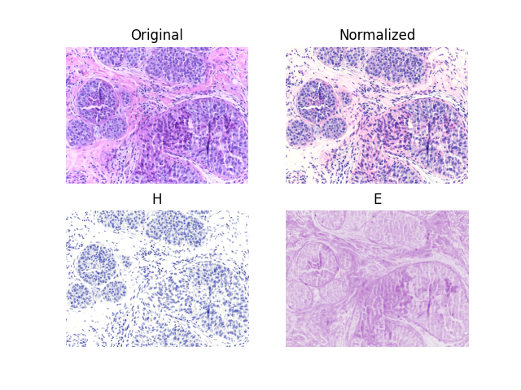

# torchstain

[](https://opensource.org/licenses/MIT)
[](https://github.com/EIDOSLAB/torchstain/actions)
[](https://pypi.org/project/torchstain/)

GPU-accelerated stain normalization tools for histopathological images. Compatible with PyTorch, TensorFlow, and Numpy.
Normalization algorithms currently implemented:

- Macenko et al. [\[1\]](#reference) (ported from [numpy implementation](https://github.com/schaugf/HEnorm_python))

## Installation

```bash
pip install torchstain
```

## Example Usage

```python
import torch
from torchvision import transforms
import torchstain
import cv2

target = cv2.cvtColor(cv2.imread("./data/target.png"), cv2.COLOR_BGR2RGB)
to_transform = cv2.cvtColor(cv2.imread("./data/source.png"), cv2.COLOR_BGR2RGB)

T = transforms.Compose([
    transforms.ToTensor(),
    transforms.Lambda(lambda x: x*255)
])

torch_normalizer = torchstain.normalizers.MacenkoNormalizer(backend='torch')
torch_normalizer.fit(T(target))

t_to_transform = T(to_transform)
norm, H, E = normalizer.normalize(I=t_to_transform, stains=True)
```




## Backend comparison

Results with 10 runs per size on a Intel(R) Core(TM) i5-8365U CPU @ 1.60GHz


|   size | numpy avg. time   | numpy tot. time   | torch avg. time   | torch tot. time   |
|--------|-------------------|-------------------|-------------------|-------------------|
|    224x224 | 0.0323s ± 0.0032  | 0.3231s           | 0.0234s ± 0.0384  | 0.2340s           |
|    448x448 | 0.1228s ± 0.0042  | 1.2280s           | 0.0395s ± 0.0168  | 0.3954s           |
|    672x672 | 0.2653s ± 0.0106  | 2.6534s           | 0.0753s ± 0.0157  | 0.7527s           |
|    896x896 | 0.4940s ± 0.0208  | 4.9397s           | 0.1262s ± 0.0159  | 1.2622s           |
|   1120x1120 | 0.6888s ± 0.0081  | 6.8883s           | 0.2002s ± 0.0141  | 2.0021s           |
|   1344x1344 | 1.0145s ± 0.0089  | 10.1448s          | 0.2703s ± 0.0136  | 2.7026s           |
|   1568x1568 | 1.2620s ± 0.0133  | 12.6200s          | 0.3680s ± 0.0128  | 3.6795s           |
|   1792x1792 | 1.4289s ± 0.0128  | 14.2886s          | 0.5968s ± 0.0160  | 5.9676s           |


## Reference

- [1] Macenko, Marc, et al. "A method for normalizing histology slides for quantitative analysis." 2009 IEEE International Symposium on Biomedical Imaging: From Nano to Macro. IEEE, 2009.
